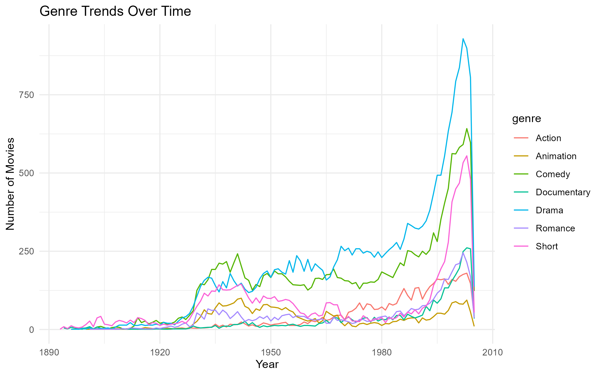
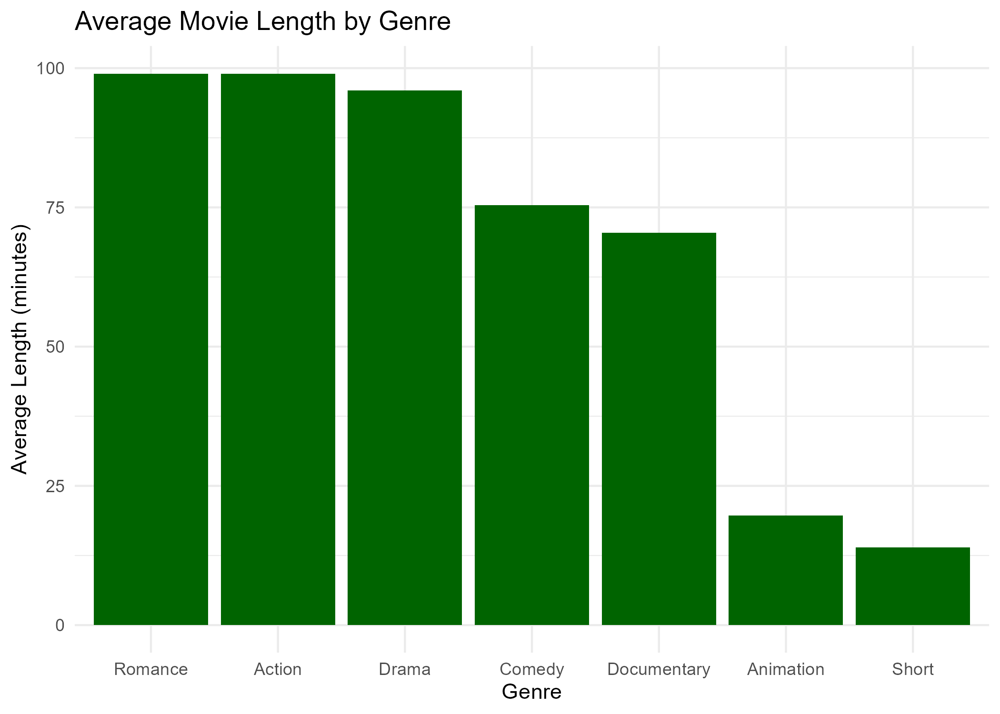
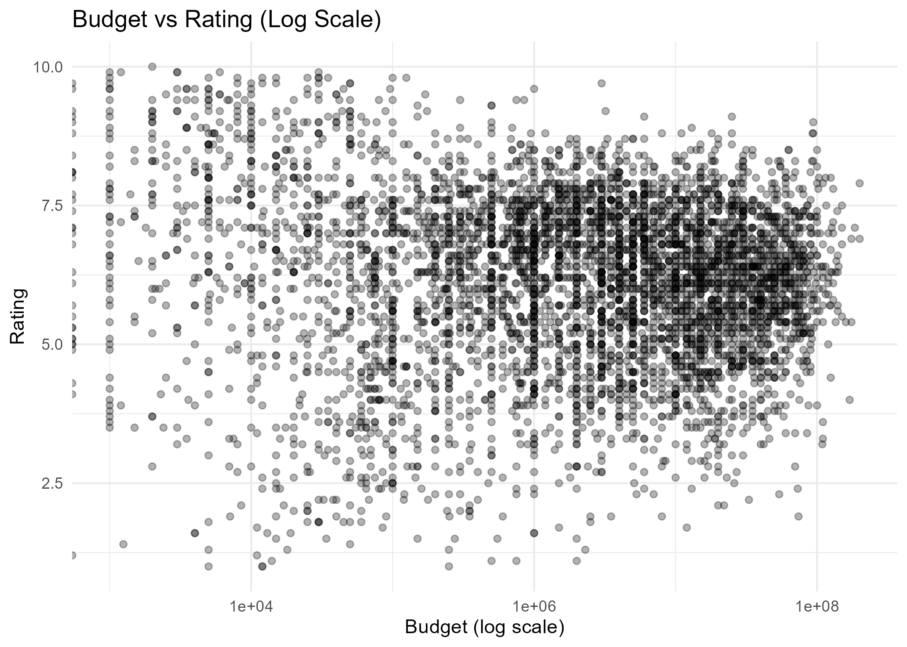
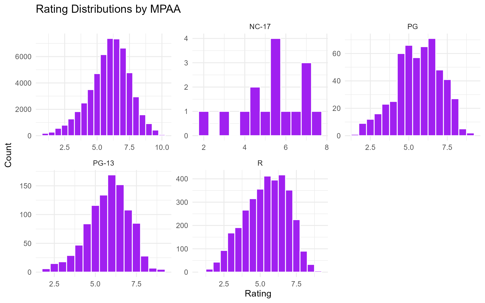

## STAT180

## R Statistics Practice

통계계산소프트웨어 수업 및 개인 연습을 통해 작성한
R 기초 분석 코드들을 정리한 repository입니다. 이 repository는 통계계산소프트웨어 수업에서 작성한
연습 코드들을 학회 지원 준비 과정에서 정리한 것입니다.

## 📊 Representative Visualizations (Final Project)

> 기말 최종 과제에서 수행한 대표적인 데이터 시각화 사례입니다.  
> `ggplot2`를 활용하여 변수 유형에 맞는 시각화 기법을 적용하는 데 중점을 두었습니다.

### Genre Trends Over Time
영화 장르 데이터를 연도별로 집계하여,  
시간에 따라 어떤 장르가 증가하거나 감소했는지를 시계열로 시각화했습니다.

---

### Average Movie Length by Genre
각 영화 장르별 평균 상영 시간을 계산하여 비교했습니다.  
장르별 특성이 러닝타임에 어떻게 반영되는지를 확인할 수 있습니다.

---

### Budget vs Rating (Log Scale)
영화 예산 분포의 비대칭성을 고려해 로그 스케일을 적용하여,  
예산과 평점 간의 관계를 산점도로 시각화했습니다.

---

### Rating Distribution by MPAA
MPAA 등급별로 영화 평점 분포를 분리하여 비교했습니다.  
Facet을 활용해 집단 간 분포 차이를 직관적으로 확인할 수 있습니다.

📁 관련 코드는 `13_data_visualization.R` 파일에 정리되어 있습니다.

## Repository Structure

| File | Description |
|-----|------------|
| 01–07 | R 기초 문법, 자료구조, 함수 및 제어문 |
| 08 | tidyverse 기초 |
| 09–11 | dplyr 기반 데이터 조작 및 reshaping |
| 12 | 문자열 및 날짜 데이터 처리 |
| **13** | **ggplot2 기반 데이터 시각화 (기말 과제 포함)** |

### Topics
- Data summarization
- Grouped statistics using dplyr
- Basic visualization with ggplot2
- Simple hypothesis testing

### Notes
각 파일에는 분석 목적과 간단한 해석을 주석으로 남겼습니다.
아직 기초 단계이지만, 데이터 분석 사고 과정을 연습하고 기록하는 데 집중했습니다.
